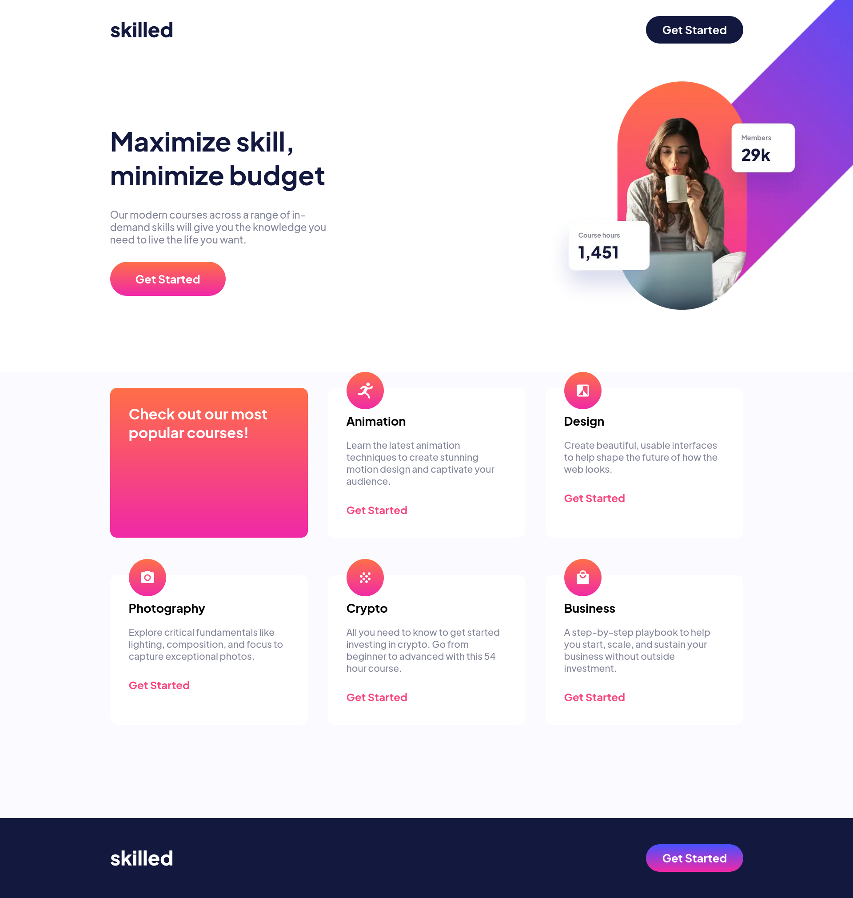
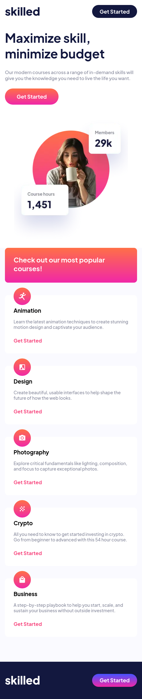

# Frontend Mentor - Skilled e-learning landing page solution

This is a solution to the [Skilled e-learning landing page challenge on Frontend Mentor](https://www.frontendmentor.io/challenges/skilled-elearning-landing-page-S1ObDrZ8q). Frontend Mentor challenges help you improve your coding skills by building realistic projects.

## Table of contents

- [Overview](#overview)
  - [The challenge](#the-challenge)
  - [Screenshot](#screenshot)
  - [Links](#links)
- [My process](#my-process)
  - [Built with](#built-with)
  - [What I learned](#what-i-learned)
  - [Continued development](#continued-development)
- [Author](#author)

**Note: Delete this note and update the table of contents based on what sections you keep.**

## Overview

### The challenge

Users should be able to:

- View the optimal layout depending on their device's screen size
- See hover states for interactive elements

### Screenshot






### Links

- [Code](https://github.com/PRINCEKK122/elearning-landing-page)
- [Live Site(Elearning)](https://elearning-fem.netlify.app/)

## My process

### Built with

- Semantic HTML5 markup
- CSS custom properties
- CSS Grid
- CSS Box Model
- Mobile-first workflow

### What I learned

1. The fun and challenging aspect of this project is the picture element. It was challenging for me to change the images based on the viewport. But then I stumbled upon the king of CSS Kevin Powell's video on youtube where he teaches the picture element, and he discusss why it is better to use this element than to write this code in CSS. Below is a snippet of how to write the picture element, and for more details about this tag, [click here](https://www.youtube.com/watch?v=Rik3gHT24AM&t=722s) to learn about this element.

```html
<picture>
  <source media="(min-width: 1200px)" 
          srcset="./assets/image-hero-desktop.webp,
                  ./assets/image-hero-desktop@2x.webp,
                  ./assets/image-hero-desktop.png,
                  ./assets/image-hero-desktop@2x.png">

  <source media="(min-width: 768px)"
          srcset="./assets/image-hero-tablet.webp,
                  ./assets/image-hero-tablet@2x.webp,
                  ./assets/image-hero-tablet.png,
                  ./assets/image-hero-tablet@2x.png">
          
  <source srcset="./assets/image-hero-mobile.webp,
                  ./assets/image-hero-mobile@2x.webp,
                  ./assets/image-hero-mobile.png,
                  ./assets/image-hero-mobile@2x.png">
  
</picture>
```

2. At times, hanging footers can be a little bit pain, I followed Kevin Powell and this was the code I used to solve the issue.
```
body {
    display: flex;
    flex-direction: column;
    min-height: 100vh;
    min-height: 100dvh;
    margin-top: auto;
}
```

### Continued development

I am still not really comofortable with CSS Grid, so I will spending time learning this technology and applying them in future front-end mentor challenges, including the React Framework.

## Author

- Website - [Prince Awuah Karikari](https://github.com/PRINCEKK122)
- Frontend Mentor - [@PRINCEKK122](https://www.frontendmentor.io/profile/PRINCEKK122)
